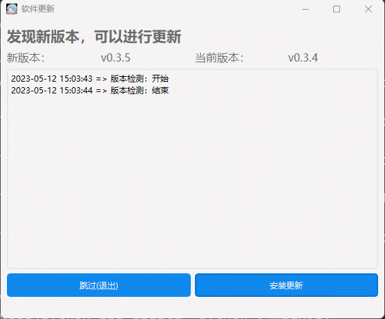

# 更新工具

一个独立的对可执行程序进行更新的工具，该工具主要是为了提供再开发，而不是直接用。（虽然更新这需求大家都是一样，但是在更新后的操作，例如直接打开新软件、替换删除原软件等要求多种多样，不想定性，这边写出接口，自行调用操作）

目前：

* 支持API请求方式，完全独立的获取更新
* 支持windows的exe
* 使用github的releases页面进行更新

## 1 环境

### conda虚拟环境
环境的导出：
```
conda env create -f environment.yml
```
环境的导出：
```
conda env export > environment.yml
```

### 自己安装
```
pip install -r requirements.txt
```
或者在自己环境补充没有安装的包
```
pip install pyqt5
pip install requests
pip install loguru
```


## 2 UI
ui是使用designer设计的，使用pyuic5转换为py文件
```
pyuic5 -o ui_main.py main.ui
```

## 3 API服务器交互方式

### 要求

为了是该更新软件完全独立于实际应用软件而诞生了这种方式，该方式的使用条件：

* 每个应用程序有唯一ID，服务器知道该应用程序的当前软件版本
* 服务器提供接口，返回：当前程序版本号、服务器存储的最新软件版本号、最新软件下载链接

请求示例：
```
GET
"http://print.qimingdaren.com/api/version/upgrade/更新软件的唯一ID" 
```
应答示例:
```
{
    "data": {
        "versionCurrent": "v0.3.4",
        "versionUpcoming": "v0.3.5",
        "versionUrl": "https://xxx.exe"
    }
}
```

versionCurrent为当前软件的版本，被应用程序启动后更新服务器信息
versionUpcoming为最新版本，当将新版本软件上传服务器后进行更新


### 使用

当满足以上条件后，在plan_api/文件夹中添加config.json，填入，实际请求接口即时两者拼接
```
{
    "id":"fzj",
    "url":"http://api/version/upgrade/"
}
```
之后执行
```
python main.py
```
效果如下图：




### 额外
该方式为了在已被包装成exe的应用软件之外添加更新功能，而完全不影响应用程序。当然只是上面的方式是不够的，所以我还额外添加了如下功能：

* 启动更新程序将自动关闭应用软件，为了直接替换应用程序
* 自动检测更新，自动执行更新，无需点击
* 下载新版本软件后，删除旧版本，且将新版本软件重命名为旧版本软件名
* 启动应用软件，关闭更新软件

如此一来，用户使用时的入口变为了这个更新程序，完全隔离的方式添加了自动更新这个功能。


## 3 通过查询github的releases页面进行更新

该方式逻辑：爬取releases的最新版本号，与保存在本地的版本号对比，如果本地版本号不存在或本地版本号小于最新版本号，则可以进行更新。由于为了独立于应用程序（不通过软件本身进行版本号获取），所以需要额外的文件来保存上一次更新的版本号，然后通过它来对比。

## 要求

github的releases页面，需要有可以比对的版本号发布名，格式其实倒是无所谓，根据自己情况修改版本判断函数version_check

## 使用

修改main.py的import，改成github方案
```
#import plan_api as version
import plan_github as version
```

修改./plan_github/version.json，可以直接如下不填写其值，如果填写则务必按照更新的github仓库的releases页面的版本号填写
```
{
    "version":""
}
```

## 效果

下图是不填写本地版本号，然后通过[示例仓库](https://github.com/lissettecarlr/autogui/releases)，进行更新的效果。完成后version.json中的version会被更新为最新版本号。


接下来是演示本地版本号低于最新版本号的情况，示例仓库最新版本号是1.5，则将version.json中改为{"current": "v1.4"}，效果如下：


## 其他配置

和之前提到的，涉及到更新后的操作，这里将其做成了配置项，实际执行在main.py的extra函数中
config.ini文件中
```
AUTO_DOWNLOAD 是否自动下载，也即打开软件后自动判断版本，如果有新版本则自动进行下载
AUTO_UPDATE_OVER_CLOSE  是否下载结束后关闭更新软件
AUTO_UPDATE_OVER_OPEN_APP 是否自动打开更新后的应用软件
AUTO_UPDATE_OVER_CLOSE_APP  是否自动关闭被打开的应用软件
AUTO_UPDATE_OVER_REPLACE 是否用新版本软件替换原来的软件
AUTO_UPDATE_OVER_UNZIP = 是否将下载下来的压缩包解压
```
